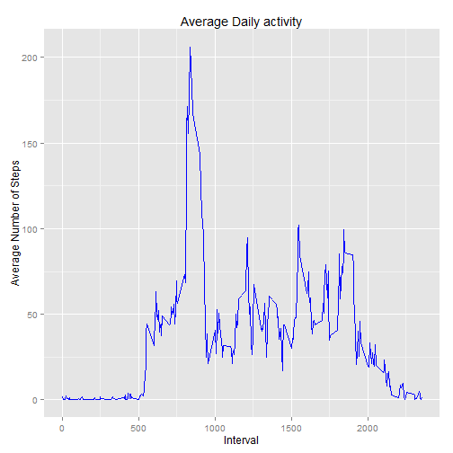
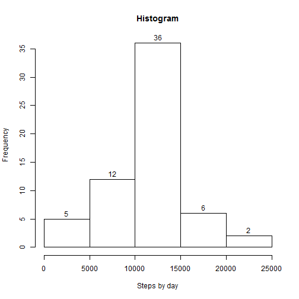
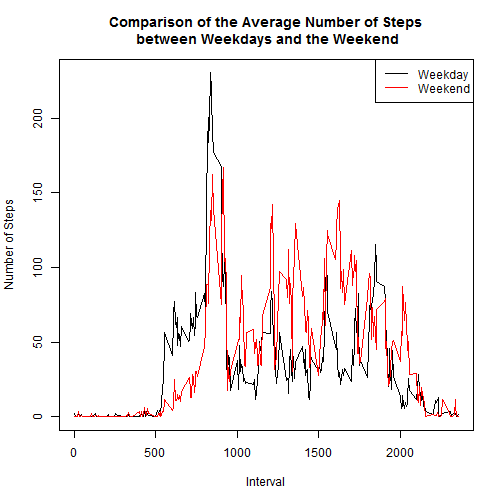

# Reproducible Research: Peer Assessment 1

## Introduction
This assignment makes use of data from a personal activity monitoring device. This device collects data at 5 minute intervals through out the day. The data consists of two months of data from an anonymous individual collected during the months of October and November, 2012 and include the number of steps taken in 5 minute intervals each day

## Loading and preprocessing the data
The data for this assignment can be downloaded from the [course web site] (https://d396qusza40orc.cloudfront.net/repdata%2Fdata%2Factivity.zip). The variables included in this dataset are:

* **Steps:** Number of steps taking in a 5-minute interval (missing values are coded as NA).
* **Date:** The date on which the measurement was taken in YYYY-MM-DD format.
* **Interval:** Identifier for the 5-minute interval in which measurement was taken.

The dataset is stored in a comma-separated-value (CSV) file and there are a total of **17,568** observations in this dataset.

```r
# download, read the data and convert columns for convenience
read_data <- function() {
    fname = "activity.zip"
    source_url = "http://d396qusza40orc.cloudfront.net/repdata%2Fdata%2Factivity.zip"
    if (!file.exists(fname)) {
        download.file(source_url, destfile = fname, method = "internal")
    }
    con <- unz(fname, "activity.csv")
    act <- read.csv(con, header = T, colClasses = c("numeric", "character", 
        "numeric"))
    act$interval <- factor(act$interval)
    act$date <- as.Date(act$date, format = "%Y-%m-%d")
    act
}
act <- read_data()
# Convert date to date class
act$Date <- as.Date(act$date, "%Y-%m-%d")
# Convert interval to a factor
act$interval <- as.factor(act$interval)
# Exrtract levels of 5-min intervals
l <- levels(act$interval)
```

Examine data.

```r
summary(act)
```

```
##      steps            date               interval          Date           
##  Min.   :  0.0   Min.   :2012-10-01   0      :   61   Min.   :2012-10-01  
##  1st Qu.:  0.0   1st Qu.:2012-10-16   5      :   61   1st Qu.:2012-10-16  
##  Median :  0.0   Median :2012-10-31   10     :   61   Median :2012-10-31  
##  Mean   : 37.4   Mean   :2012-10-31   15     :   61   Mean   :2012-10-31  
##  3rd Qu.: 12.0   3rd Qu.:2012-11-15   20     :   61   3rd Qu.:2012-11-15  
##  Max.   :806.0   Max.   :2012-11-30   25     :   61   Max.   :2012-11-30  
##  NA's   :2304                         (Other):17202
```

## What is mean total number of steps taken per day?
The histogram of the steps by day:

```r
library(ggplot2)
```

```
## Warning: package 'ggplot2' was built under R version 2.15.3
```

```r
stepsbyday <- tapply(act$steps, act$date, sum)
hist(stepsbyday, xlab = "Steps by day", main = "Histogram", labels = T)
```

 

```r
med <- mean(stepsbyday, na.rm = T)
medi <- median(stepsbyday, na.rm = T)
paste("The mean is", round(med, 2), "steps by day")
```

```
## [1] "The mean is 10766.19 steps by day"
```

```r
paste("The median is", round(medi, 2), "steps by day")
```

```
## [1] "The median is 10765 steps by day"
```

## What is the average daily activity pattern?
Plotting the average daily activity:

```r
# Find the average number of steps grouped by intereval
Steps = tapply(act$steps, act$interval, mean, na.rm = T)
# Convert levels of intervals into numeric
Interval <- as.numeric(l)
# Create the dataframe df of the Interval and Steps columns
df <- data.frame(Steps, Interval)
g <- ggplot(df, aes(Interval, Steps))
g + geom_line(colour = "blue") + ggtitle("Average Daily activity") + ylab("Average Number of Steps")
```

 

Calculate the average daily activity:

```r
averageSteps <- aggregate(steps ~ interval, FUN = mean, data = act)
maxIndex <- which.max(averageSteps$steps)
val <- averageSteps[maxIndex, ]
paste("The interval", val$interval, "has the maximum average of steps", round(val$steps, 
    0))
```

```
## [1] "The interval 835 has the maximum average of steps 206"
```

## Imputing missing values
Note that there are a number of days/intervals where there are missing values (coded as `NA`). The presence of missing days may introduce bias into some calculations or summaries of the data.

First, in order to visualize in which variable the `NA`s are:

```r
# Total missing data
missing <- is.na(act)
# Number of missing values
(n.missing <- sum(missing))
```

```
## [1] 2304
```

```r
NAdata <- data.frame(steps = 0, date = 0, interval = 0)
NAdata$steps <- length(which(is.na(act$steps)))
NAdata$date <- length(which(is.na(act$date)))
NAdata$interval <- length(which(is.na(act$interval)))
paste("The number of rows with NAs from steps column is", NAdata$steps)
```

```
## [1] "The number of rows with NAs from steps column is 2304"
```

```r
paste("The number of rows with NAs from interval column is", NAdata$date)
```

```
## [1] "The number of rows with NAs from interval column is 0"
```

```r
paste("The number of rows with NAs from date column is", NAdata$interval)
```

```
## [1] "The number of rows with NAs from date column is 0"
```

To filling the `NA` values from Steps columns, we use to replace them with the mean value at the same interval across days. 

```r
calc_steps_per_interval <- function(act) {
    steps_perin <- aggregate(act$steps, by = list(interval = act$interval), 
        FUN = mean, na.rm = T)
    # convert to integers for plotting
    steps_perin$interval <- as.integer(levels(steps_perin$interval)[steps_perin$interval])
    colnames(steps_perin) <- c("interval", "steps")
    steps_perin
}
steps_per_interval <- calc_steps_per_interval(act)
impute_means <- function(act, defaults) {
    na_data <- which(is.na(act$steps))
    defaults <- steps_per_interval
    na_news <- unlist(lapply(na_data, FUN = function(idx) {
        interval = act[idx, ]$interval
        defaults[defaults$interval == interval, ]$steps
    }))
    im_steps <- act$steps
    im_steps[na_data] <- na_news
    im_steps
}
new_act <- data.frame(steps = impute_means(act, steps_per_interval), date = act$date, 
    interval = act$interval)
```

Summarizing the new dataset with `NA` values filled:

```r
summary(new_act)
```

```
##      steps            date               interval    
##  Min.   :  0.0   Min.   :2012-10-01   0      :   61  
##  1st Qu.:  0.0   1st Qu.:2012-10-16   5      :   61  
##  Median :  0.0   Median :2012-10-31   10     :   61  
##  Mean   : 37.4   Mean   :2012-10-31   15     :   61  
##  3rd Qu.: 27.0   3rd Qu.:2012-11-15   20     :   61  
##  Max.   :806.0   Max.   :2012-11-30   25     :   61  
##                                       (Other):17202
```

Plotting the new histogram

```r
stepsbyday2 <- tapply(new_act$steps, new_act$date, sum)
hist(stepsbyday2, xlab = "Steps by day", main = "Histogram", labels = T)
```

 

```r
med2 <- mean(stepsbyday2, na.rm = T)
medi2 <- median(stepsbyday2, na.rm = T)
paste("The new mean is", round(med2, 2), "steps by day")
```

```
## [1] "The new mean is 10766.19 steps by day"
```

```r
paste("The new median is", round(medi2, 2), "steps by day")
```

```
## [1] "The new median is 10766.19 steps by day"
```

The difference between the new and old mean/median is:

```r
paste("Mean Old - Mean New =", med - med2)
```

```
## [1] "Mean Old - Mean New = 0"
```

```r
paste("Median Old - Median New =", medi - medi2)
```

```
## [1] "Median Old - Median New = -1.1886792452824"
```

Comparing with the calculations donet, we observe that while the mean value remains unchanghed, the median value has shifted closer to the mean.

## Are there differences in activity patterns between weekdays and weekends?

We create a new factor variable in the dataset with two levels: "weekday" and "weekend", indicating whether a given date is a weekday or weekend day. We use new dataset with `NA` values filled.

```r
# Extract weekdays
new_act$Days <- weekdays(as.Date(as.character(new_act$date)))
# Create a logical vector d where Days are Saturday or Sunday
d <- new_act$Days == "sábado" | new_act$Days == "domingo"
# Call Saturday and Sunday Weekend
new_act$Days[d] = "Weekend"
# Call weekdays (Monday through Friday) Weekdays
new_act$Days[!d] = "Weekday"
# Weekdays
new_actWD <- new_act[new_act$Days == "Weekday", ]
# Weekend
new_actWE <- new_act[new_act$Days == "Weekend", ]
# Convert levels of interval into numeric for weekdays
IntervalWD <- as.numeric(levels(as.factor(new_actWD$interval)))
# Convert levels of interval into numeric for the weekend
IntervalWE <- as.numeric(levels(as.factor(new_actWE$interval)))
# Average number of steps during weekdays
avgWD <- tapply(new_actWD$steps, new_actWD$interval, mean)
# Average number of steps during the weekend
avgWE <- tapply(new_actWE$steps, new_actWE$interval, mean)
# Data frame combining average number of steps and interval during
# weekdays
dfWD <- data.frame(avgWD, IntervalWD)
# Data frame combining average number of steps and interval during the
# weekend
dfWE <- data.frame(avgWE, IntervalWE)
# Convert Days into factor
new_act$Days <- as.factor(new_act$Days)
new_act$interval <- factor(new_act$interval)
# Use base plot
plot(dfWD$IntervalWD, dfWD$avgWD, type = "l", main = "Comparison of the Average Number of Steps\n between Weekdays and the Weekend", 
    xlab = "Interval", ylab = "Number of Steps")
lines(dfWE$IntervalWE, dfWE$avgWE, col = "red")
legend("topright", c("Weekday", "Weekend"), col = c("black", "red"), lty = 1)
```

 

```r
# plot(dfWE$IntervalWE, dfWE$avgWE, type='l', main='Weekend',
# xlab='Interval', ylab='Number of Steps')
```

Although the maximum average number of steps during weekdays is higher than that during the weekend, there seems to be on average more activities during the weekend. This is due to the fact that during weekdays, the activities centre in the early morning and in the evening (before having dinner) due to the work, but during the weekend, they distribute during the whole day due to the free time that have.

```r
# Use the lattice Package

# Add a column to the data frames that include weekdays and weekend days
dfWD$wDays <- rep("Weekday", nrow(dfWD))
dfWE$wDays <- rep("Weekend", nrow(dfWD))
# Rename column names to match
colnames(dfWD) <- c("Steps", "Interval", "wDays")
colnames(dfWE) <- c("Steps", "Interval", "wDays")
# rbind the dataframes
df <- rbind(dfWD, dfWE)
# Convert wDays column into a factor
df$wDays <- factor(df$wDays)

# Use lattice library to plot
library(lattice)
```

```
## Warning: package 'lattice' was built under R version 2.15.3
```

```r
xyplot(Steps ~ Interval | wDays, data = df, type = "l", layout = c(1, 2), ylab = "Average Number of Steps")
```

 


